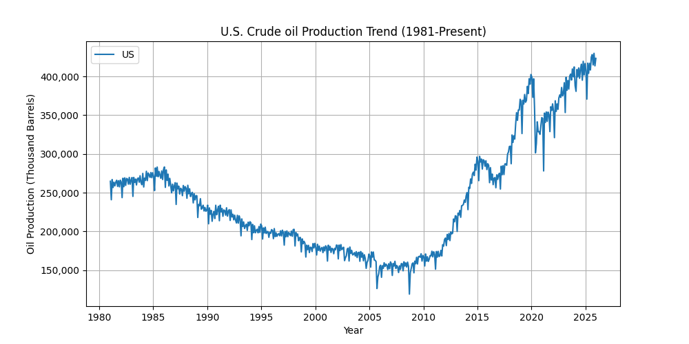

# U.S. Crude Oil Production Analysis

## Project Overview
This project analyzes crude oil production trends in the United State from 1981 to present.

## Tools Used
- SQL (data extraxtion)
- Python (pandas, matplotlib)
- Data Visualization

## Dataset
Source: U.S. Energy Information Administration (EIA) (.gov)
www.eia.gov

## Key Finding
- U.S. Oil production declined during the 1980s-1990s
- Significant growth occurated after 2010 due to shale oil boom
- Production reached peak levels in recent years

## Visualization

## Analysis Result
### Production Trend Insight 
- U.S. oil production declined from the 1980s until around 2008
- A significant increase occured after 2010 due to the shale oil boom
- Production reached its highest levels in recent years

### Key Statistics
- Average Production: **241,498.18 thousand barrels**
- Highest Production: **429,777.00 thousand barrels**
- Lowest Production: **119,208.00 thousand barrels**

## Conclusion
This analysis show strong upward trend in U.S. oil production in the last decade, driven by technological advancements in extraction.

## Author
Dik Tri Martini

## Note
This project demonstrates data cleaning, analysis, and visualization using Python.
